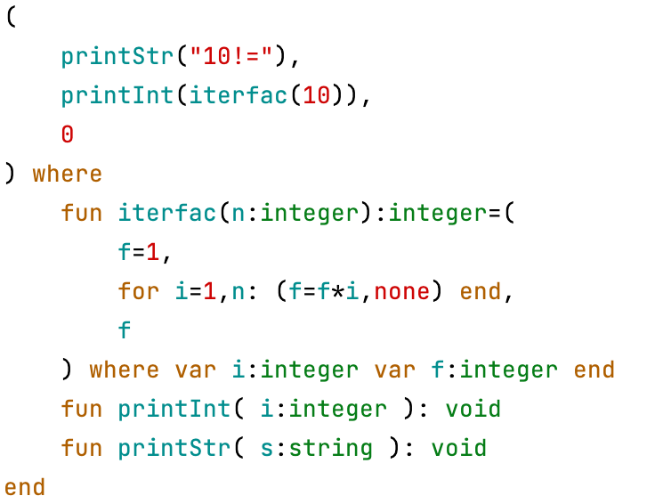
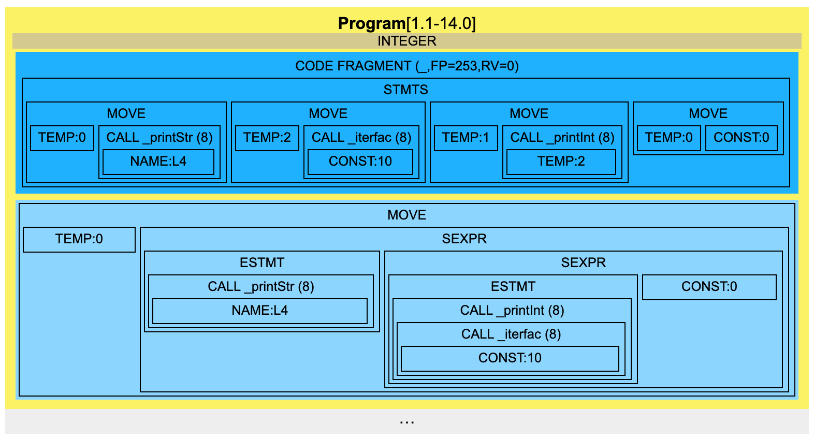

# prev - a simple language compiler
Based on the 2015 compilers course at FRI.

This repository contains various code examples to highlight the capabilities of the PREV language. The `prev.jar` can
be used as an interpreter or to generate MMX assembly which can in turn be executed using `mmixware/mmix` emulator.



```bash
java -jar prev.jar --phase=build hello_world.prev
java -jar prev.jar --phase=exec hello_world.prev
```

It can also generate visualizations of all stages of compilation process.

```bash
java -jar prev.jar --loggedphases=imcode --phase=imcode --xsldir=xsl hello_world.prev
```



There are some utilities contained in the `Makefile`:
```bash
make mmix  # git clone mmixware & make, required to run MMX assembly
make hello_world.exec  # phase=exec
make hello_world.run  # phase=build, compile, link & simulate
make hello_world.imcode.xml  # phase=imcode, loggedphases=imcode
```
